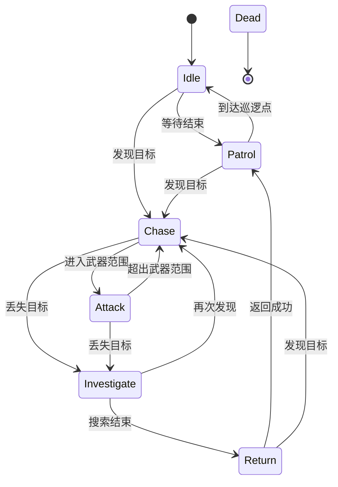
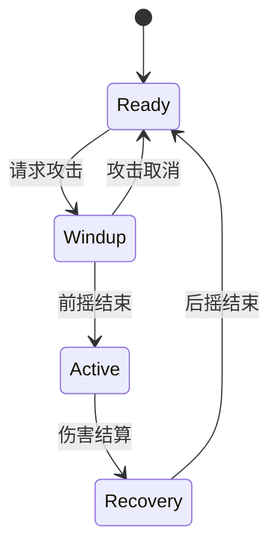
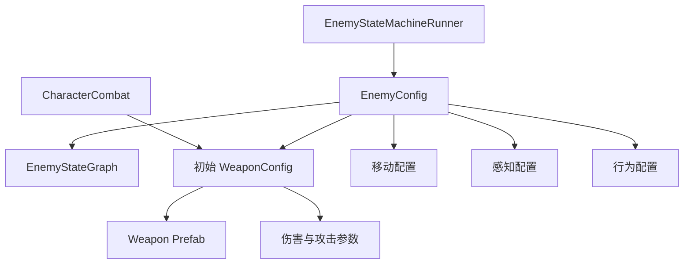
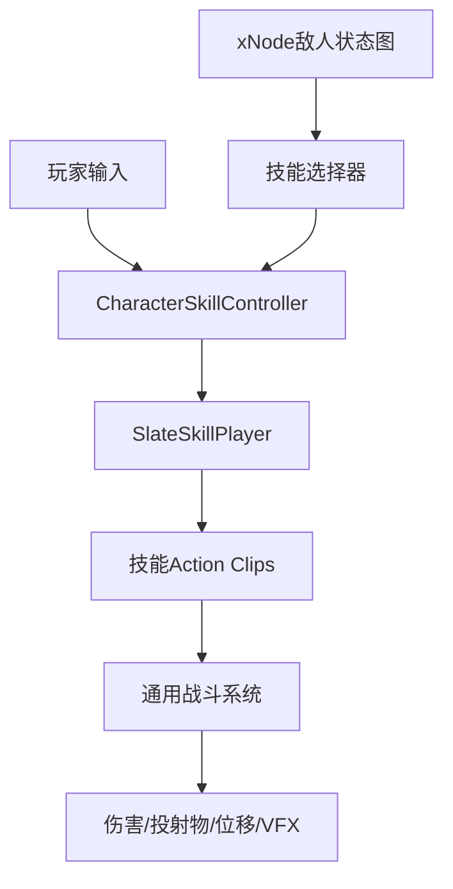

# 01 设计方案（整理版）

基于 ChatGPT 分享对话《Unity敌人AI设计方案》整理。该对话从基础 FSM 方案逐步演进为「xNode 状态机 + Slate 技能时间轴 + ScriptableObject 配置」的完整架构。

---

## 一、Demo 玩法设计

一个"小而完整"的 3D 俯视角射击技术 Demo：

- 中小型封闭战斗区域，有墙体、箱子等障碍物
- 放置 3～5 个敌人，敌人拥有固定巡逻点
- 玩家使用枪械/近战武器攻击敌人
- 玩家或所有敌人死亡后显示简单结果界面（R 重开）

### 玩家操作

| 操作 | 功能 |
|---|---|
| WASD | 移动 |
| 鼠标位置 | 控制角色朝向 |
| 鼠标左键 | 攻击（射击 / 近战挥砍） |
| R | 重新开始 |
| F1 | 显示 AI 调试信息（可选） |

> 建议使用 Unity Input System；若重点是 AI，传统 Input API 亦可。

---

## 二、敌人行为设计（xNode 状态图）

### AI 状态机（最终为 xNode 可视化状态图）



全局转换：`Any State --生命值归零--> Dead`

### 各状态职责

| 状态 | 职责 |
|---|---|
| Idle | 原地停留随机时间，缓慢转动观察；发现玩家立即进入 Chase |
| Patrol | 依次/随机前往巡逻点，到达后进入 Idle；持续检测玩家 |
| Chase | NavMeshAgent 追击，定期重寻路；进入武器射程且视线无遮挡 → Attack；丢失目标 → Investigate |
| Attack | 停止寻路、转向玩家、通过技能控制器释放技能；玩家离开射程 → Chase；丢失目标 → Investigate |
| Investigate | 前往最后发现位置，短时间转向搜索；重新发现 → Chase；搜索失败 → Return |
| Return | 返回最近巡逻点/出生区域，到达后重新进入 Patrol；途中仍可发现玩家 |
| Dead | 禁用感知、攻击与寻路，播放死亡效果，延迟销毁/禁用 |

### xNode 节点类型

| 节点 | 作用 |
|---|---|
| EnemyEntryNode | 指定状态机入口 |
| EnemyAnyStateNode | 检查死亡等全局转换 |
| IdleStateNode / PatrolStateNode / ChaseStateNode / AttackStateNode / InvestigateStateNode / ReturnStateNode / DeadStateNode | 对应状态 |

核心原则：

- **xNode 图负责"状态之间怎么连接"**；状态节点负责"何时沿连接切换"；普通角色组件负责"具体如何移动、感知、攻击"
- **节点不保存运行时数据**（多个敌人可共用同一张图）。节点字段只存配置，如 `idleDuration`、`repathInterval`；运行时数据放在 `EnemyBlackboard`
- 语义化输出端口表达转换，例如 `Chase` 节点输出 `attack` / `investigate` 端口

### 状态机运行器

- `EnemyStateMachineRunner`：读取图 → 找到 Entry/AnyState → 每帧「先全局转换，再当前状态转换，最后 Tick」
- 状态生命周期：`Enter → EvaluateTransition（无转换则 Tick）→ Exit → 切换 → Enter`
- 建议增加编辑器图校验器（唯一 Entry、Entry 已连接、AnyState/Dead 存在、关键端口已连接、无孤立状态、无多连接语义端口等）

---

## 三、敌人感知系统

不只看距离，实现「距离 + 视野角度 + 障碍检测 + 警觉值」：

1. 玩家处于感知半径内
2. 玩家处于敌人正面视野角内
3. `Physics.Raycast` 判断中间是否有墙体
4. 满足条件增加警觉值
5. 警觉值达阈值才确认发现玩家

- 玩家短暂经过视野边缘 → 只产生怀疑
- 玩家持续暴露 → 正式追击
- 玩家离开视野 → 警觉值逐渐下降
- 战斗中丢失目标 → 保留最后发现位置

性能：使用 `Physics.OverlapSphereNonAlloc` 或降低检测频率（如每 0.1s 一次）。

---

## 四、统一战斗系统（玩家/敌人共用）

### 核心思路

玩家与敌人都通过 `CharacterCombat` 使用武器，区别仅在攻击指令来源：

```text
玩家输入 ──► CharacterCombat ──► Weapon（近战/远程）──► IDamageable
敌人 AI  ──► CharacterCombat ──► Weapon（近战/远程）──► IDamageable
```

### 角色统一结构

```text
Character
├── CharacterCombat   武器装备与攻击入口
├── CharacterMotor    移动和转向
├── Health            生命值（玩家/敌人共用）
├── FactionMember     阵营信息
├── Animator
└── WeaponHolder      武器挂点
```

### 攻击三阶段（Windup / Active / Recovery）



### 关键代码接口

```csharp
// 玩家
characterCombat.TryAttack(mouseWorldPosition);
// 敌人AI（AttackStateNode）
characterCombat.TryAttack(player.position);
// 两者调用完全一致
```

- 武器统一抽象：`Weapon.Initialize(owner, config)` / `CanAttack()` / `TryAttack(WeaponAttackContext)` / `CancelAttack()`
- 近战：`Physics.OverlapBoxNonAlloc` 在 Active 阶段检测，`HashSet<IDamageable>` 过滤重复目标
- 远程：生成投射物（Projectile），支持散射、多发、生命周期
- 伤害：`IDamageable.TakeDamage(DamageInfo)`，`DamageInfo` 含 Amount / Source / SourceFaction / HitPoint / HitDirection / Knockback / DamageType
- 阵营：`FactionMember.CanDamage(other)` 判定敌对关系（后续可扩展为 `FactionRelationConfig`）

### 近战敌人追击细节

- `NavMeshAgent.stoppingDistance = Max(0.2f, attackRange * 0.75f)`
- 进入/退出攻击范围加滞后区间，避免状态横跳：`enter = attackRange`，`exit = attackRange + 0.4f`

---

## 五、ScriptableObject 配置系统

### 配置关系



### WeaponConfig（基类，含近战/远程子类）

- 通用：weaponId、displayName、weaponPrefab、damage、knockbackForce、windupDuration、activeDuration、recoveryDuration、canMoveWhileAttacking、attackMoveSpeedMultiplier、targetLayers
- 抽象属性：`MinAttackRange` / `MaxAttackRange` / `PreferredAttackRange`
- `MeleeWeaponConfig`：attackRange、preferredAttackRange、hitboxOffset、hitboxSize、detectDuringEntireActivePhase、canHitMultipleTargets、挥砍/命中特效音效
- `RangedWeaponConfig`：min/max/preferred range、projectilePrefab、projectileSpeed、projectileLifetime、spreadAngle、projectileCount、枪口特效音效

| 武器 | 最小距离 | 理想距离 | 最大距离 |
|---|---:|---:|---:|
| 剑 | 0 | 1.4 | 1.8 |
| 长矛 | 0 | 2.2 | 2.8 |
| 手枪 | 0 | 6 | 9 |
| 步枪 | 3 | 9 | 14 |

### EnemyConfig（分组配置）

`EnemyVitalsSettings`（生命/硬直/死亡延迟）、`EnemyMovementSettings`（巡逻/追击速度、加速度、角速度、停止容差）、`EnemyPerceptionSettings`（视野距离/角度、扫描间隔、警觉/遗忘时长、层级）、`EnemyBehaviourSettings`（Idle 时长、重寻路间隔、攻击退出容差、搜索时长、返回停止距离）、`EnemyCombatSettings`（初始武器、转向速度、反应时间、是否要求视线）

```text
敌人表现 = EnemyConfig + EnemyStateGraph + WeaponConfig + 场景中的巡逻点
```

### 配置 vs 运行时数据边界

| 放 ScriptableObject（只读模板） | 放运行时组件/黑板 |
|---|---|
| 最大生命值 | 当前生命值 |
| 移动速度 | 当前速度 |
| 视野距离 | 当前目标 |
| 攻击伤害 | 当前冷却时间 |
| 攻击前摇 | 是否正在攻击 |
| 武器射程 | 当前弹药 |
| 搜索持续时间 | 已搜索时间 |
| 状态图 | 当前状态节点 |
| 巡逻规则 | 当前巡逻点索引 |

禁止运行时修改配置：`config.Vitals.maxHealth -= damage;` / `weaponConfig.Damage += buffValue;`

### EnemyActor 初始化顺序

```text
生命值 → 移动 → 感知 → 装备武器 → 启动 xNode 状态机
```

（状态机最后启动，因为 Chase/Attack 依赖已初始化的武器与移动组件）

---

## 六、Slate 技能系统

### 分层职责



| 数据 | 负责内容 |
|---|---|
| EnemyConfig | 生命、速度、感知、xNode图、初始武器 |
| WeaponConfig | 基础伤害、武器类型、武器模型、可用技能 |
| SkillConfig | 冷却、距离、目标类型、Slate时间轴Prefab |
| Slate时间轴 | 动画、前摇、伤害帧、位移、子弹、特效、音效 |
| SkillRuntime | 当前冷却、目标、是否施法、已命中对象 |

> 避免多处重复配置同一参数：攻击前摇既然由 Slate 时间轴决定，就不放进 `WeaponConfig`。

### SkillConfig

```text
Identity: skillId, displayName
Slate:    Cutscene timelinePrefab
Cast:     targetType(None/Direction/Position/Unit), cooldown, min/maxCastRange
Control:  lockMovement, faceTarget, canBeInterrupted
Damage:   damageMultiplier
```

### WeaponConfig 关联技能

```text
Weapon_Sword
├── Base Damage: 20
├── Basic Attack: Skill_SwordSlash
├── Skill 1: Skill_HeavySlash
└── Skill 2: Skill_DashSlash
```

同一个武器配置可同时装备给玩家和敌人，双方使用完全相同的技能时间轴。

### Slate 技能时间轴示例

**Skill_SwordSlash（总长 0.75s）**

```text
0.00             0.20      0.35                0.75
│----------------│=========│--------------------│
开始/锁移动        伤害窗口       后摇               结束

Caster Group
├── Animation Track:  Sword Slash Animation  0.00–0.75
├── Rotation Track:   Face Target            0.00–0.20
├── Gameplay Track:   Melee Hit Window       0.20–0.35
├── Effect Track:     Sword Trail            0.18–0.38
└── Audio Track:      Swing Sound            0.18
```

**Skill_PistolShot**：Face Target 0.00–0.10 / Fire Animation 0.00–0.40 / Spawn Projectile 0.12 / Muzzle Flash 0.12 / Fire Sound 0.12 / Camera Shake 0.12（可选）

**Skill_DashSlash**：Lock Movement 0.00 / Dash Forward 0.10–0.35 / Sword Animation 0.00–0.65 / Melee Hit Window 0.22–0.38 / Trail 0.15–0.45 / Finish Skill 0.70

### 建议扩展的 Slate ActionClip

| Clip | 功能 | 类型 |
|---|---|---|
| FaceTargetClip | 面向技能目标 | 持续 |
| LockMovementClip | 锁定角色移动 | 瞬时/持续 |
| DashClip | 冲刺或突进 | 持续 |
| MeleeHitWindowClip | 一段时间内开启近战检测 | 持续 |
| SpawnProjectileClip | 指定时间生成投射物 | 瞬时 |
| SpawnEffectClip | 创建技能特效 | 瞬时 |
| PlaySkillAudioClip | 播放音效 | 瞬时 |
| ApplyBuffClip | 添加 Buff | 持续 |
| SkillSignalClip | 发送技能事件 | 瞬时 |
| SetInvincibleClip | 设置无敌时间 | 持续 |
| InterruptibleClip | 设置可打断区间 | 持续 |

### 技能运行上下文与控制器

- `SkillExecutionContext`：每次施法独立创建，含 Caster/Combat/Skill/Weapon/Target/TargetPosition/HitTargets，`CalculateDamage() = Weapon.BaseDamage * Skill.DamageMultiplier`
- `CharacterSkillController`：`TryCast(skill, request)` 校验（非空、非施法中、非冷却、范围内）→ 锁移动 → `SlateSkillPlayer.Play(context, callback)` → `FinishSkill`（解锁移动、记冷却）；`Interrupt()` 强制打断
- `SlateSkillPlayer` 作为适配层隔离 Slate API，便于版本升级
- 每个角色必须拥有独立 Slate 时间轴实例（播放位置、目标、命中记录独立）

### xNode Attack 节点调用技能

```csharp
// AttackStateNode.Tick
if (context.SkillController.IsCasting) return;
SkillConfig skill = context.SkillSelector.SelectSkill(
    context.Combat.CurrentWeaponConfig, target);
if (skill != null)
    context.SkillController.TryCast(skill,
        new SkillCastRequest(target.position, target));
```

技能播放过程中不因短暂距离变化退出 Attack；死亡时 `SkillController.Interrupt()` + `Motor.Stop()` 全局强制中断。

### Slate 编辑器预览注意事项

- 预览可做：动画、角色位移、粒子特效、武器轨迹、攻击范围 Gizmos
- 预览禁止：真实扣血、永久生成投射物、修改 ScriptableObject、写入冷却、重复触发一次性战斗事件
- 伤害逻辑需限定 `if (!Application.isPlaying) return;`
- 反向拖动时间轴时清理：临时特效、HitBox、预览投射物、移动锁定、无敌状态

---

## 七、相机设计

- 俯视角固定偏移跟随，约 45～60° 俯角
- `LateUpdate` 跟随玩家，`SmoothDamp` 平滑移动
- 可加入少量鼠标方向偏移（提前看到射击方向）
- 可选使用 Cinemachine；自实现简单跟随相机更易展示基础能力

---

## 八、调试功能（加分项）

- 当前状态显示在敌人头顶
- Scene 视图绘制感知半径、视野扇形
- 绿线=看见玩家，红线=视线被阻挡
- 黄球=最后发现玩家的位置
- Inspector 显示当前目标、警觉值、攻击冷却
- F1 开关运行时调试信息

---

## 九、推荐项目结构

```text
Assets/Game
├── AI
│   ├── Runtime
│   │   ├── Core        EnemyContext / EnemyBlackboard / EnemyStateMachineRunner
│   │   ├── Graph       EnemyStateGraph / Nodes(Entry/AnyState/Idle/Patrol/Chase/Attack/Investigate/Return/Dead)
│   │   ├── Perception  EnemyPerception
│   │   └── Movement    EnemyMotor
│   ├── Editor          EnemyGraphValidator / EnemyStateNodeEditor
│   └── Graphs          DefaultEnemyStateGraph.asset / Enemy_AggressiveGraph.asset
├── Characters
│   ├── Player          PlayerController / PlayerCombatInput / Health
│   └── Enemy           EnemyActor
├── Combat
│   ├── CharacterCombat.cs / IDamageable.cs / DamageInfo.cs / Health.cs / FactionMember.cs
│   ├── Weapons         Weapon.cs / WeaponConfig.cs / MeleeWeapon(.cs/.Config) / RangedWeapon(.cs/.Config)
│   ├── Skills          SkillConfig.cs / CharacterSkillController.cs / SkillExecutionContext.cs / SkillCastRequest.cs / SlateSkillPlayer.cs / SkillSelector.cs
│   ├── SlateClips      FaceTargetClip.cs / LockMovementClip.cs / DashClip.cs / MeleeHitWindowClip.cs / SpawnProjectileClip.cs / ...
│   └── Projectiles     Projectile.cs / ProjectilePool.cs
├── Camera              TopDownCamera
├── UI                  结果界面 / 重开
├── Configs
│   ├── Enemies         Enemy_MeleeGrunt.asset / Enemy_RangedGuard.asset / Enemy_Elite.asset
│   ├── Weapons         Weapon_Sword.asset / Weapon_Spear.asset / Weapon_Pistol.asset / Weapon_Rifle.asset
│   └── Skills          Skill_SwordSlash.asset / Skill_PistolShot.asset / Skill_DashSlash.asset
├── Prefabs
├── Scenes
└── Tests               EditMode / PlayMode 测试
```

---

## 十、核心设计原则（汇总）

1. AI决策、感知、移动、攻击相互分离
2. 状态只调用组件能力，不直接依赖具体实现
3. 玩家和敌人共用伤害接口与战斗系统
4. 参数使用 ScriptableObject 配置（只读模板）
5. xNode 节点无运行时状态，多敌人可共享一张图
6. Slate 只做时序，伤害结算交给战斗系统
7. 动画仅表现状态，不控制核心逻辑
8. 攻击阶段以代码计时为核心、动画事件辅助表现
